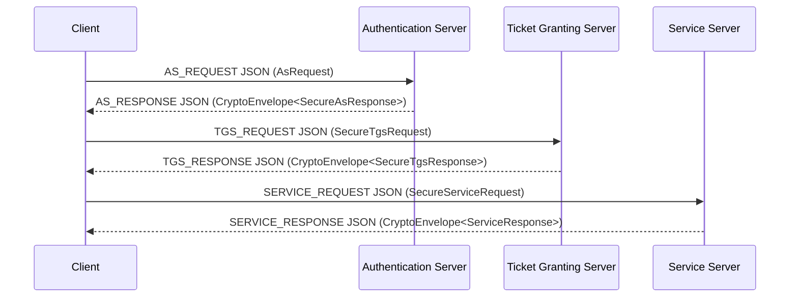

# Kerberos-Inspired Modular Authentication Demo

Proyecto Java de portafolio que implementa desde cero un flujo de autenticacion
distribuida inspirado en Kerberos 4, centrado ahora en una arquitectura modular
propia.

Este repositorio no es MIT Kerberos oficial y no debe presentarse como un
sistema listo para produccion critica. Es una pieza de ingenieria aplicada para
mostrar arquitectura distribuida, diseno de protocolo, hardening incremental,
pruebas y ejecucion local reproducible.

## Estado Actual

Fase actual: **Fase 12 + Fase 13: frontend demo local e integracion real con WebSocket Gateway**.

| Area | Rol | Estado |
| --- | --- | --- |
| `auth-core/` | DTOs del protocolo, configuracion y replay cache | Activo |
| `auth-crypto/` | AES-GCM, `CryptoEnvelope`, derivacion y claves de sesion | Activo |
| `auth-transport/` | `ProtocolEnvelope`, JSON/TCP y DTOs seguros | Activo |
| `auth-as/` | Authentication Server modular | Ejecutable |
| `auth-tgs/` | Ticket Granting Server modular | Ejecutable |
| `auth-service/` | Servicio protegido modular | Ejecutable |
| `auth-client-sdk/` | Cliente modular, CLI y audit runner | Ejecutable |
| `auth-websocket-gateway/` | Gateway WebSocket separado para futuras integraciones web | Ejecutable |
| `auth-web-demo/` | Frontend vanilla local para observar el flujo via WebSocket | Demo local |
| `docs/` | Documentacion tecnica y auditorias | Activa |

El codigo legacy fisico fue retirado del proyecto principal. Su existencia se
resume en [docs/legacy-summary.md](docs/legacy-summary.md), sin conservarlo
como ruta ejecutable actual.

## Arquitectura Modular

Vista simplificada:



La ruta principal usa DTOs tipados, JSON/TCP, AES-GCM con `CryptoEnvelope`,
replay cache, configuracion demo/strict y auditoria reproducible.

El WebSocket Gateway no reemplaza AS, TGS ni Service. Expone una capa de
integracion que recibe mensajes WebSocket y ejecuta el flujo modular existente
mediante `AuthClient`.

`auth-web-demo` es una interfaz local sin framework que habla solamente con el
Gateway WebSocket. No modifica AS, TGS ni Service.

## Requisitos

Consulta tambien [requirements.txt](requirements.txt).

- Java 17 o superior.
- Maven 3.9+.
- Node.js 18+ y npm para la demo web local.
- Git.
- Windows, Linux o macOS con terminal.
- Docker no es requisito en esta fase.

## Compilar Y Probar

Desde esta carpeta:

```bash
mvn -q -DskipTests compile
mvn test
```

En la verificacion de Fase 12 + Fase 13 pasaron:

```bash
mvn -q -DskipTests compile
mvn test
mvn -pl auth-websocket-gateway -am test
```

La demo web tambien valida con:

```bash
cd auth-web-demo
npm install
npm run build
```

## Ejecutar Sin Docker

En Windows, abre tres terminales para servidores y una para cliente:

```cmd
scripts\run-as.bat
```

```cmd
scripts\run-tgs.bat
```

```cmd
scripts\run-service.bat
```

```cmd
scripts\run-client.bat
```

Los scripts compilan con Maven antes de ejecutar las clases modulares.

En Linux/macOS tambien existen scripts equivalentes:

```bash
scripts/run-as.sh
scripts/run-tgs.sh
scripts/run-service.sh
scripts/run-client.sh
```

## WebSocket Gateway

Primero levanta AS, TGS y Service. Despues:

```cmd
scripts\run-websocket-gateway.bat
```

En Linux/macOS:

```bash
scripts/run-websocket-gateway.sh
```

Por defecto escucha en `127.0.0.1:2800`. Variables:

- `AUTH_WS_HOST`
- `AUTH_WS_PORT`

Mensaje minimo:

```json
{"type":"START_AUTH_FLOW","requestId":"manual-1","clientId":"1","serviceId":"1"}
```

## Frontend Demo Local

La demo web esta en `auth-web-demo/`. No usa React, Vite, TypeScript, bundler ni
dependencias npm externas.

Orden recomendado en cinco terminales:

```cmd
scripts\run-as.bat
scripts\run-tgs.bat
scripts\run-service.bat
scripts\run-websocket-gateway.bat
scripts\run-web-demo.bat
```

Abre:

```text
http://127.0.0.1:5173
```

En la UI, usa `ws://127.0.0.1:2800`, pulsa `Connect` y luego
`Start Auth Flow`. Deben aparecer eventos `FLOW_*` y un `FLOW_RESULT` con el
resultado del servicio.

## Auditoria Modular

Con AS, TGS y Service levantados:

```cmd
scripts\run-audit.bat --iterations 5
```

El runner genera evidencia en:

- `docs/audits/latest-run.md`
- `docs/audits/latest-run.json`

La auditoria de independencia del runtime modular esta en
[docs/audits/legacy-dependency-audit.md](docs/audits/legacy-dependency-audit.md).

## Configuracion

Variables comunes:

- `AUTH_MODE`: `demo`, `local` o `strict`.
- `AUTH_AS_PORT`
- `AUTH_TGS_PORT`
- `AUTH_SERVICE_PORT`
- `AUTH_DEMO_CLIENT_ID`
- `AUTH_DEMO_TGS_ID`
- `AUTH_DEMO_SERVICE_ID`
- `AUTH_TICKET_TTL_MINUTES`
- `AUTH_ALLOWED_SKEW_SECONDS`
- `AUTH_REPLAY_WINDOW_SECONDS`
- `AUTH_DEMO_CLIENT_SECRET`
- `AUTH_DEMO_CLIENT_TGS_KEY`
- `AUTH_DEMO_TGS_SECRET`
- `AUTH_DEMO_CLIENT_SERVICE_KEY`
- `AUTH_DEMO_SERVICE_SECRET`
- `AUTH_DEMO_PBKDF2_SALT`

Los nombres de secretos actuales usan `AUTH_DEMO_*`. En `AUTH_MODE=strict`,
estos valores deben definirse explicitamente y no pueden quedarse en defaults.

## CI

GitHub Actions vive en la raiz Git:

- `../.github/workflows/maven.yml`

El workflow usa `working-directory: PruebaKeberos` y ejecuta:

- `mvn -q -DskipTests compile`
- `mvn test`

## Limitaciones Actuales

- No es production-ready.
- No hay Docker.
- Existe frontend demo local, pero no hay despliegue web ni login real.
- El WebSocket Gateway existe como capa de integracion separada; no sustituye
  el runtime TCP modular.
- El replay cache es local por proceso.
- No hay TLS ni autenticacion mutua de transporte.
- El codec JSON es propio y acotado a los DTOs del proyecto.
- El gateway WebSocket ya tiene E2E real y una demo web local desacoplada.

## Roadmap

1. Endurecer el canal Gateway/frontend con TLS o autenticacion de demo si se
   autoriza.
2. Evaluar un parser JSON mantenido si el codec propio crece fuera de su alcance
   acotado.
3. Agregar pruebas E2E de navegador si se autoriza tooling de browser.
4. Introducir Docker y Docker Compose solo en una fase futura de despliegue.

Mas detalle:

- [docs/execution-guide.md](docs/execution-guide.md)
- [docs/architecture.md](docs/architecture.md)
- [docs/protocol-flow.md](docs/protocol-flow.md)
- [docs/security-hardening-roadmap.md](docs/security-hardening-roadmap.md)
- [docs/websocket-gateway.md](docs/websocket-gateway.md)
- [docs/frontend-contract.md](docs/frontend-contract.md)
- [docs/frontend-demo.md](docs/frontend-demo.md)
