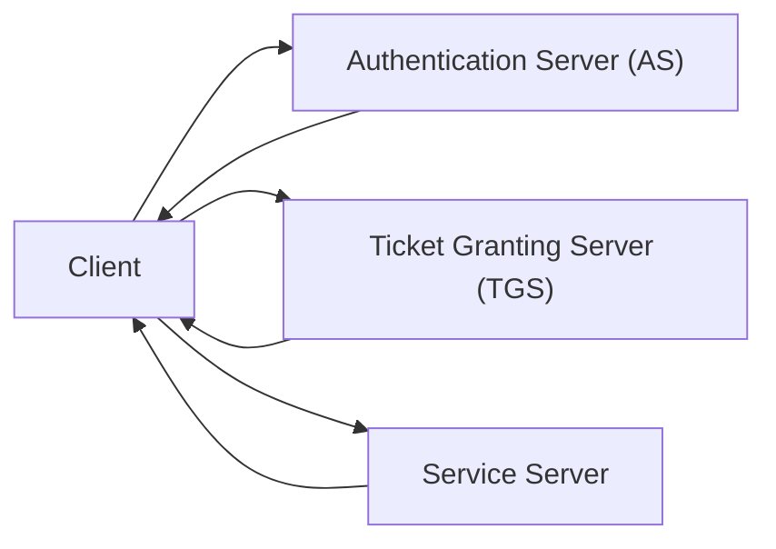
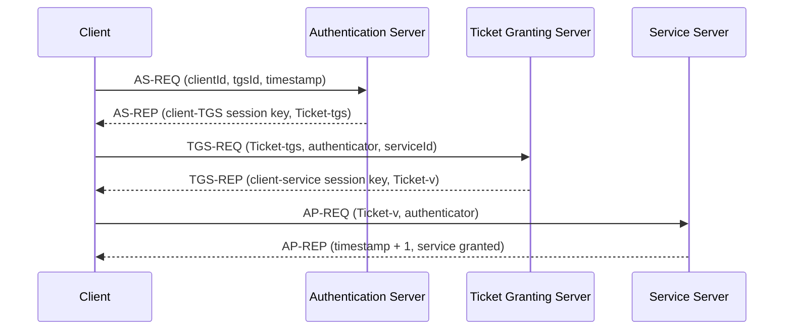

# Kerberos-Inspired Authentication Prototype

A Java portfolio project that explores a Kerberos-style authentication flow,
then incrementally refactors it into a cleaner, more modular design.

This repository contains two realities at the same time:

1. a runnable legacy demo under `Kerberos/` and `Seguridad/`
2. an in-progress modular redesign under `auth-*`

It is intentionally documented as both a working prototype and a migration
exercise in protocol design, transport refactoring, and security hardening.

> Important note
>
> This is not an official MIT Kerberos implementation.
> It is a learning and engineering project inspired by Kerberos-style exchanges.

## What this project is

This project models the classic three-stage authentication flow:

- Client -> Authentication Server (AS)
- Client -> Ticket Granting Server (TGS)
- Client -> Service Server

The current runnable path demonstrates ticket issuance, service ticket exchange,
and service access with symmetric cryptography and Java sockets.

The newer `auth-*` modules are being introduced to separate concerns more
cleanly:

- `auth-core`: protocol DTOs and shared domain contracts
- `auth-transport`: transport adapters and compatibility layers
- `auth-crypto`: future cryptographic abstractions
- `auth-as`, `auth-tgs`, `auth-service`: future runtime services
- `auth-client-sdk`: future client-facing integration layer
- `docs`: architecture and security documentation

## Why this project exists

This repository exists for three reasons:

1. to understand how ticket-based authentication systems work end to end
2. to practice turning a classroom-style prototype into a more serious codebase
3. to show engineering judgment, not just implementation speed

The interesting part is not only "making the demo work".
It is also documenting tradeoffs, identifying real security weaknesses, and
migrating the code in small, reviewable steps without breaking the existing
flow.

## Architecture

### Current repository shape

| Area | Role | Status |
| --- | --- | --- |
| `Kerberos/` | Runnable legacy prototype with AS, TGS, Service, Client | Working demo |
| `Seguridad/` | Legacy socket and crypto helpers | Working demo |
| `auth-core/` | Typed protocol contracts | Active migration |
| `auth-transport/` | Transport abstraction and legacy bridge | Active migration |
| `auth-crypto/` | Crypto module | Planned |
| `auth-as/`, `auth-tgs/`, `auth-service/` | Modular service runtimes | Planned |
| `auth-client-sdk/` | Future client SDK | Planned |
| `docs/` | Architecture and security notes | Active |

### Runtime view



### Migration strategy

The project is being refactored from:

- untyped `HashMap<String, Object>` messages
- Java object serialization over sockets
- tightly coupled runtime classes

toward:

- typed DTOs in `auth-core`
- explicit transport adapters in `auth-transport`
- isolated service modules
- better security boundaries and better documentation

The first migration step already started in the Client -> AS exchange, where
`AsRequest` now exists as a typed DTO and is bridged back into the legacy
payload format for compatibility.

## Protocol flow

The current functional flow follows this sequence:



### Step-by-step

1. The client asks the AS for a ticket-granting ticket.
2. The AS returns a client-TGS session key plus a TGS ticket.
3. The client presents that ticket to the TGS to request access to a service.
4. The TGS returns a client-service session key plus a service ticket.
5. The client presents the service ticket and an authenticator to the service.
6. The service validates the request and returns a success response.

## Improvements over the original prototype

This repository no longer presents the prototype as "done".
Instead, it shows an engineering path from a working demo to a better system.

Current improvements include:

- a Maven-based monorepo layout for modular growth
- typed protocol DTOs in `auth-core`
- a transport compatibility layer in `auth-transport`
- the first incremental migration of the Client -> AS request path
- unit tests for the new transport mapping layer
- a documented security hardening roadmap in
  [docs/security-hardening-roadmap.md](docs/security-hardening-roadmap.md)
- clearer separation between legacy runtime code and migration targets

Just as important, the project now documents what is still wrong instead of
hiding it.

## How to run

### Prerequisites

- Java 17 or newer
- `javac` and `java` available on your PATH
- Maven if you want to run the modular tests in `auth-*`

### Option A: run the current legacy demo

This is the main runnable path today.

From the repository root in PowerShell:

```powershell
New-Item -ItemType Directory -Force build\classes | Out-Null
$sources = Get-ChildItem Kerberos,Seguridad,auth-core\src\main\java,auth-transport\src\main\java -Recurse -Filter *.java | ForEach-Object { $_.FullName }
javac -d build\classes $sources
```

Start each server in its own terminal:

```powershell
java -cp build\classes Kerberos.AuthenticationServer
```

```powershell
java -cp build\classes Kerberos.TicketGrantingServer
```

```powershell
java -cp build\classes Kerberos.ServiceServer
```

Then run the client:

```powershell
java -cp build\classes Kerberos.Client
```

If everything is working, the client should complete the AS -> TGS -> Service
flow and print the granted service message.

### Optional demo commands

Run concurrent clients:

```powershell
java -cp build\classes Kerberos.ClientRunner
```

Run the malicious test client:

```powershell
java -cp build\classes Kerberos.ClientePruebaMaliciosaAuto
```

That tester can replay, corrupt, and flood requests against the running
services, which is useful for discussing both the current weaknesses and the
planned hardening work.

### Option B: run the modular tests

If Maven is installed, you can run the tests for the migration modules:

```bash
mvn -pl auth-core,auth-transport test
```

This does not launch the full legacy demo.
It validates the new typed contracts and the compatibility layer that bridges
them into the current runtime flow.

## Demo

The repository supports a strong demo narrative for GitHub, internships, and
technical interviews:

1. show the AS -> TGS -> Service exchange working end to end
2. explain how tickets and authenticators move through the system
3. point out the current prototype weaknesses honestly
4. show the modular redesign in `auth-core` and `auth-transport`
5. explain how the migration keeps the working flow alive while improving the
   design

Good live demo paths:

- `Kerberos.Client` for the happy path
- `Kerberos.ClientRunner` for concurrent clients
- `Kerberos.ClientePruebaMaliciosaAuto` for replay/corruption/flood scenarios

## Limitations

This project is intentionally honest about its current state.

The runnable legacy path still has important limitations:

- Java object serialization is still used over sockets
- the legacy flow still contains hardcoded secrets
- the current crypto path still needs the AES-CBC to AES-GCM migration
- replay defense is not yet fully implemented
- the modular `auth-*` services are not yet the main runtime path
- the repository is not production-ready

This is best described as:

- a serious learning project
- a protocol and systems design exercise
- a portfolio project with active refactoring

It should not be described as:

- production-grade authentication infrastructure
- an enterprise-ready security platform
- an official Kerberos distribution

## Future work

The next major steps are already identified:

- finish moving message contracts from legacy maps to typed DTOs
- expand the migration from `AsRequest` to the rest of the protocol
- move crypto concerns into `auth-crypto`
- replace Java serialization with safer transport formats
- externalize secrets and runtime configuration
- migrate from AES-CBC to AES-GCM
- add replay cache and time-skew validation
- turn `auth-as`, `auth-tgs`, and `auth-service` into real modular runtimes

For the current hardening plan, see:

- [docs/security-hardening-roadmap.md](docs/security-hardening-roadmap.md)

## Why this is worth reviewing

For recruiters and internship reviewers, this project shows more than a toy
implementation:

- protocol-level thinking
- incremental refactoring in a live codebase
- honesty about security debt
- architecture evolution from prototype to modules
- willingness to document tradeoffs, not just features

That combination is the real point of the repository.
