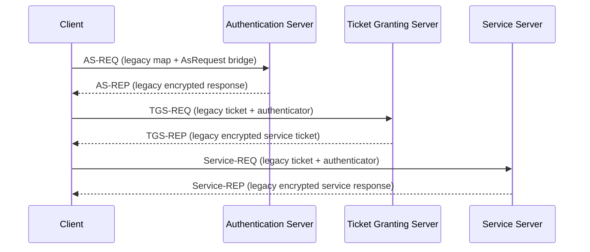

# Kerberos-Inspired Distributed Authentication Demo

Proyecto Java de portafolio que implementa desde cero un flujo de autenticacion
distribuida inspirado en Kerberos 4 y lo migra gradualmente hacia una
arquitectura modular mas clara, testeable y documentada.

Este repositorio no es MIT Kerberos oficial y no debe presentarse como un
sistema listo para produccion critica. Es una pieza de ingenieria aplicada para
mostrar arquitectura distribuida, diseno de protocolo, refactorizacion,
seguridad aplicada, pruebas y ejecucion local reproducible.

## Estado Actual

El proyecto tiene dos capas que conviven:

| Area | Rol | Estado |
| --- | --- | --- |
| `Kerberos/` | Demo legacy funcional con AS, TGS, Service y Client | Ruta principal ejecutable |
| `Seguridad/` | Helpers legacy de sockets, serializacion y utilidades | Usado por la demo |
| `auth-core/` | DTOs del protocolo, configuracion y replay cache | Migracion activa |
| `auth-transport/` | Transporte Java Object y mappers legacy | Migracion activa |
| `auth-crypto/` | Base moderna AES-GCM con envelope | Preparado, no integrado al legacy |
| `auth-as/`, `auth-tgs/`, `auth-service/` | Modulos runtime futuros | Estructura Maven creada |
| `auth-client-sdk/` | SDK cliente futuro | Estructura Maven creada |
| `docs/` | Documentacion tecnica | Activa |

La demo legacy sigue funcionando localmente sin Docker. Docker queda
explicitamente como trabajo futuro para la fase final de despliegue.

## Por Que Existe

El objetivo no es vender un producto de seguridad, sino mostrar una evolucion
realista de un prototipo:

- flujo distribuido AS -> TGS -> Service -> Client;
- contratos tipados que reemplazan progresivamente `HashMap<String,Object>`;
- mappers que conectan los DTOs nuevos con el runtime legacy;
- replay cache inicial para rechazar autenticadores reutilizados;
- base AES-GCM preparada sin romper el cifrado legacy existente;
- documentacion honesta de riesgos, limites y roadmap.

## Arquitectura

Vista simplificada del flujo actual:



La migracion modular vive en:

- `auth-core`: `AsRequest`, `AsResponse`, `TgsRequest`, `TgsResponse`,
  `ServiceRequest`, `ServiceResponse`, `TicketTgs`, `TicketService`,
  `ClientAuthenticator`, `ErrorResponse`, `AuthConfig`, `ReplayCache`.
- `auth-transport`: `JavaObjectTransport` y mappers `Legacy*Mapper`.
- `auth-crypto`: `CryptoEnvelope`, `AeadCryptoService`,
  `AesGcmCryptoService`.

## Mejoras Sobre El Prototipo Original

- Monorepo Maven con modulos separados.
- DTOs tipados del protocolo en `auth-core`.
- Mappers legacy para AS, TGS y Service.
- Pruebas unitarias para mappers, replay cache y AES-GCM.
- Replay cache en memoria integrada de forma minima en TGS y Service.
- Configuracion centralizada con defaults compatibles para demo local.
- Logs legacy reducidos para no imprimir claves, tickets descifrados completos
  ni respuestas con secretos de sesion.
- Documentacion ejecutable para correr sin Docker.

## Requisitos

Consulta tambien [requirements.txt](requirements.txt).

- Java 17 o superior recomendado. Este entorno se verifico con Java/Javac 19.
- Maven 3.9+ recomendado para ejecutar los modulos `auth-*`.
- Git.
- Windows, Linux o macOS con terminal.
- Docker no es requisito en esta fase.

Verificacion rapida:

```bash
java -version
javac -version
mvn -version
git --version
```

## Clonar Y Entrar Al Proyecto

```bash
git clone <repo-url>
cd PruebaKeberos
```

Si el repositorio fue clonado con otro nombre, entra a la carpeta que contiene
este `README.md` y el `pom.xml` raiz.

## Compilar Con Maven

Maven valida la migracion modular, no reemplaza todavia la demo legacy:

```bash
mvn -q -DskipTests compile
mvn test
```

En este entorno local esos comandos fueron intentados, pero `mvn` no estaba en
el PATH. El proyecto conserva comandos `javac` para ejecutar la demo sin Docker.

## Ejecutar Pruebas

Cuando Maven este instalado:

```bash
mvn test
```

Las pruebas cubren:

- mappers legacy de AS/TGS/Service;
- transporte Java Object basico;
- replay cache en memoria;
- cifrado/descifrado AES-GCM preparado para la migracion.

## Ejecutar La Demo Legacy Sin Docker

### Windows CMD

Desde la raiz del proyecto:

```cmd
if not exist build\classes mkdir build\classes
(for /r Kerberos %f in (*.java) do @echo %f) > sources.txt
(for /r Seguridad %f in (*.java) do @echo %f) >> sources.txt
(for /r auth-core\src\main\java %f in (*.java) do @echo %f) >> sources.txt
(for /r auth-transport\src\main\java %f in (*.java) do @echo %f) >> sources.txt
(for /r auth-crypto\src\main\java %f in (*.java) do @echo %f) >> sources.txt
javac -d build\classes @sources.txt
```

Abre cuatro terminales separadas en este orden:

```cmd
java -cp build\classes Kerberos.AuthenticationServer
```

```cmd
java -cp build\classes Kerberos.TicketGrantingServer
```

```cmd
java -cp build\classes Kerberos.ServiceServer
```

```cmd
java -cp build\classes Kerberos.Client
```

### PowerShell

```powershell
New-Item -ItemType Directory -Force build\classes | Out-Null
$sources = Get-ChildItem Kerberos,Seguridad,auth-core\src\main\java,auth-transport\src\main\java,auth-crypto\src\main\java -Recurse -Filter *.java | ForEach-Object { $_.FullName }
javac -d build\classes $sources
```

Luego ejecuta los mismos cuatro procesos con `java -cp build\classes ...`.

### Linux/macOS

```bash
mkdir -p build/classes
find Kerberos Seguridad auth-core/src/main/java auth-transport/src/main/java auth-crypto/src/main/java -name "*.java" > sources.txt
javac -d build/classes @sources.txt
```

Terminales separadas:

```bash
java -cp build/classes Kerberos.AuthenticationServer
```

```bash
java -cp build/classes Kerberos.TicketGrantingServer
```

```bash
java -cp build/classes Kerberos.ServiceServer
```

```bash
java -cp build/classes Kerberos.Client
```

## Configuracion Local

`AuthConfig` centraliza valores de demo con defaults compatibles. Se pueden
sobrescribir con variables de entorno:

- `AUTH_AS_PORT`, `AUTH_TGS_PORT`, `AUTH_SERVICE_PORT`
- `AUTH_DEMO_CLIENT_ID`, `AUTH_DEMO_TGS_ID`, `AUTH_DEMO_SERVICE_ID`
- `AUTH_LEGACY_CLIENT_SECRET`
- `AUTH_LEGACY_CLIENT_TGS_KEY`
- `AUTH_LEGACY_TGS_SECRET`
- `AUTH_LEGACY_CLIENT_SERVICE_KEY`
- `AUTH_LEGACY_SERVICE_SECRET`
- `AUTH_TICKET_TTL_MINUTES`
- `AUTH_ALLOWED_SKEW_SECONDS`
- `AUTH_REPLAY_WINDOW_SECONDS`

Los defaults existen solo para demo local y compatibilidad con el flujo legacy.

## Como Revisar La Migracion Modular

- DTOs: `auth-core/src/main/java/com/portfolio/auth/core/protocol/dto`
- Configuracion: `auth-core/src/main/java/com/portfolio/auth/core/config`
- Replay cache: `auth-core/src/main/java/com/portfolio/auth/core/replay`
- Mappers: `auth-transport/src/main/java/com/portfolio/auth/transport/legacy`
- AES-GCM: `auth-crypto/src/main/java/com/portfolio/auth/crypto`
- Pruebas: `auth-*/src/test/java`

## Limitaciones Actuales

- El runtime principal todavia usa sockets y serializacion Java.
- `AESUtils` legacy sigue usando AES/CBC por compatibilidad; no se cambio el IV
  porque el formato actual no transporta IV por mensaje.
- AES-GCM existe en `auth-crypto`, pero no cifra aun los tickets legacy.
- Replay cache es local en memoria por proceso.
- Los modulos `auth-as`, `auth-tgs`, `auth-service` y `auth-client-sdk` aun no
  reemplazan al runtime legacy.
- No hay Docker en esta fase.
- No es production-ready.

## Roadmap

1. Integrar completamente replay cache y validacion de clock skew en DTOs
   versionados.
2. Migrar tickets y respuestas a `CryptoEnvelope` + AES-GCM.
3. Reemplazar gradualmente `ObjectInputStream/ObjectOutputStream`.
4. Externalizar configuracion con archivo local opcional y variables de entorno.
5. Agregar pruebas de integracion AS -> TGS -> Service.
6. Convertir `auth-as`, `auth-tgs`, `auth-service` y `auth-client-sdk` en
   runtimes modulares reales.
7. Introducir Docker y Docker Compose solo en una fase posterior de despliegue.

Mas detalle:

- [docs/execution-guide.md](docs/execution-guide.md)
- [docs/architecture.md](docs/architecture.md)
- [docs/protocol-flow.md](docs/protocol-flow.md)
- [docs/security-hardening-roadmap.md](docs/security-hardening-roadmap.md)
