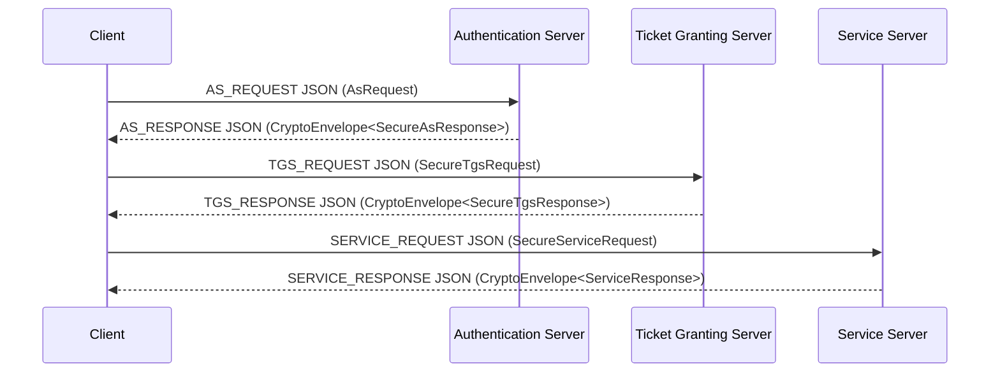

# Kerberos-Inspired Distributed Authentication Demo

Proyecto Java de portafolio que implementa desde cero un flujo de autenticacion
distribuida inspirado en Kerberos 4 y lo migra gradualmente hacia una
arquitectura modular mas clara, testeable y documentada.

Este repositorio no es MIT Kerberos oficial y no debe presentarse como un
sistema listo para produccion critica. Es una pieza de ingenieria aplicada para
mostrar arquitectura distribuida, diseno de protocolo, refactorizacion,
seguridad aplicada, pruebas y ejecucion local reproducible.

## Estado Actual

Fase actual: **Fases 4-7: runtime modular, transporte JSON, AES-GCM real e
integracion automatizada inicial**.

El proyecto tiene dos capas que conviven:

| Area | Rol | Estado |
| --- | --- | --- |
| `Kerberos/` | Demo legacy funcional con AS, TGS, Service y Client | Referencia historica ejecutable |
| `Seguridad/` | Helpers legacy de sockets, serializacion y utilidades | Usado por la demo |
| `auth-core/` | DTOs del protocolo, configuracion y replay cache | Compartido por legacy bridge y runtime modular |
| `auth-transport/` | Mappers legacy, transporte JSON, TCP modular y DTOs seguros | Activo en ruta modular |
| `auth-crypto/` | AES-GCM, `CryptoEnvelope`, derivacion de claves y claves de sesion | Activo en ruta modular |
| `auth-as/` | Authentication Server modular | Ejecutable |
| `auth-tgs/` | Ticket Granting Server modular | Ejecutable |
| `auth-service/` | Servicio protegido modular | Ejecutable |
| `auth-client-sdk/` | Cliente modular y CLI | Ejecutable |
| `docs/` | Documentacion tecnica | Activa |

La ruta modular ya ejecuta AS -> TGS -> Service -> Client sin Java
serialization, sin `SealedObject` y sin `AESUtils`. La demo legacy sigue
existiendo y puede ejecutarse localmente sin Docker.

## Por Que Existe

El objetivo no es vender un producto de seguridad, sino mostrar una evolucion
realista de un prototipo:

- flujo distribuido AS -> TGS -> Service -> Client;
- contratos tipados que reemplazan progresivamente `HashMap<String,Object>`;
- mappers que conectan los DTOs nuevos con el runtime legacy;
- replay cache inicial para rechazar autenticadores reutilizados;
- ruta modular con JSON sobre TCP y AES-GCM real mediante `CryptoEnvelope`;
- documentacion honesta de riesgos, limites y roadmap.

## Arquitectura

Vista simplificada del flujo modular:



La migracion modular vive en:

- `auth-core`: `AsRequest`, `AsResponse`, `TgsRequest`, `TgsResponse`,
  `ServiceRequest`, `ServiceResponse`, `TicketTgs`, `TicketService`,
  `ClientAuthenticator`, `ErrorResponse`, `AuthConfig`, `ReplayCache`.
- `auth-transport`: `JavaObjectTransport`, mappers `Legacy*Mapper`,
  `ProtocolEnvelope`, `JsonMessageCodec`, `TcpMessageClient`,
  `TcpMessageServer` y DTOs seguros de la ruta modular.
- `auth-crypto`: `CryptoEnvelope`, `AeadCryptoService`,
  `AesGcmCryptoService`, `AesKeyDerivation`, `SessionKeys`.

## Mejoras Sobre El Prototipo Original

- Monorepo Maven con modulos separados.
- DTOs tipados del protocolo en `auth-core`.
- Mappers legacy para AS, TGS y Service.
- Runtime modular real en `auth-as`, `auth-tgs`, `auth-service` y
  `auth-client-sdk`.
- Transporte JSON modular sin `ObjectInputStream`, `ObjectOutputStream`,
  `HashMap` como contrato principal ni `SealedObject`.
- AES-GCM real en la ruta modular para tickets, autenticadores y respuestas.
- El cliente y las respuestas AS/TGS/Service ya crean DTOs y despues bajan a
  mapas legacy para preservar compatibilidad.
- Pruebas unitarias para mappers, replay cache, configuracion, JSON y AES-GCM.
- Prueba de integracion Maven para flujo modular completo, replay, servicio
  inexistente, autenticador invalido y requestId repetido.
- Replay cache en memoria integrada de forma minima en TGS y Service, con
  registro atomico por clave.
- Configuracion centralizada con defaults compatibles para demo local.
- Logs legacy reducidos para no imprimir claves, tickets descifrados completos
  ni respuestas con secretos de sesion.
- Documentacion ejecutable para correr sin Docker.

## Requisitos

Consulta tambien [requirements.txt](requirements.txt).

- Java 17 o superior recomendado. Este entorno se verifico con Java/Javac 19.
- Maven 3.9+ recomendado para ejecutar los modulos `auth-*`.
- Git.
- Windows, Linux o macOS con terminal.
- Docker no es requisito en esta fase.

Verificacion rapida:

```bash
java -version
javac -version
mvn -version
git --version
```

## Clonar Y Entrar Al Proyecto

```bash
git clone <repo-url>
cd PruebaKeberos
```

Si el repositorio fue clonado con otro nombre, entra a la carpeta que contiene
este `README.md` y el `pom.xml` raiz.

## Compilar Con Maven

Maven es la validacion principal esperada para los modulos `auth-*`:

```bash
mvn -q -DskipTests compile
mvn test
```

En este entorno local esos comandos fueron intentados, pero `mvn` no estaba en
el PATH. Como verificacion complementaria, las fuentes principales y tests
compilaron con `javac`, y se ejecuto un smoke modular AS -> TGS -> Service ->
Client con puertos alternos `2400`, `2401` y `2402`.

## Ejecutar Pruebas

Cuando Maven este instalado:

```bash
mvn test
```

Las pruebas cubren:

- mappers legacy de AS/TGS/Service;
- transporte Java Object basico;
- codec JSON modular;
- cifrado JSON + AES-GCM con `CryptoEnvelope`;
- replay cache en memoria;
- configuracion local y overrides por entorno;
- integracion modular AS -> TGS -> Service;
- replay, servicio inexistente, autenticador invalido y requestId repetido.

## Ejecutar Runtime Modular Sin Docker

Con Maven instalado:

```bash
mvn -q -DskipTests compile
```

En Windows, levanta cuatro terminales en este orden:

```bash
java -cp auth-as/target/classes;auth-core/target/classes;auth-crypto/target/classes;auth-transport/target/classes com.portfolio.auth.as.AuthenticationServerApp
```

```bash
java -cp auth-tgs/target/classes;auth-core/target/classes;auth-crypto/target/classes;auth-transport/target/classes com.portfolio.auth.tgs.TicketGrantingServerApp
```

```bash
java -cp auth-service/target/classes;auth-core/target/classes;auth-crypto/target/classes;auth-transport/target/classes com.portfolio.auth.service.ProtectedServiceApp
```

```bash
java -cp auth-client-sdk/target/classes;auth-core/target/classes;auth-crypto/target/classes;auth-transport/target/classes com.portfolio.auth.client.ClientCli
```

En PowerShell tambien puedes compilar con `javac` para una verificacion local:

```powershell
New-Item -ItemType Directory -Force build\check\phase47-main | Out-Null
$roots = 'auth-core\src\main\java','auth-crypto\src\main\java','auth-transport\src\main\java','auth-as\src\main\java','auth-tgs\src\main\java','auth-service\src\main\java','auth-client-sdk\src\main\java'
$sources = Get-ChildItem $roots -Recurse -Filter *.java | ForEach-Object { $_.FullName }
javac -d build\check\phase47-main $sources
```

Y ejecutar:

```powershell
$env:AUTH_AS_PORT='2400'; $env:AUTH_TGS_PORT='2401'; $env:AUTH_SERVICE_PORT='2402'
java -cp build\check\phase47-main com.portfolio.auth.as.AuthenticationServerApp
java -cp build\check\phase47-main com.portfolio.auth.tgs.TicketGrantingServerApp
java -cp build\check\phase47-main com.portfolio.auth.service.ProtectedServiceApp
java -cp build\check\phase47-main com.portfolio.auth.client.ClientCli
```

Ejecuta cada servidor en una terminal separada antes del cliente.

## Ejecutar La Demo Legacy Sin Docker

### Windows CMD

Desde la raiz del proyecto:

```cmd
if not exist build\classes mkdir build\classes
(for /r Kerberos %f in (*.java) do @echo %f) > sources.txt
(for /r Seguridad %f in (*.java) do @echo %f) >> sources.txt
(for /r auth-core\src\main\java %f in (*.java) do @echo %f) >> sources.txt
(for /r auth-transport\src\main\java %f in (*.java) do @echo %f) >> sources.txt
(for /r auth-crypto\src\main\java %f in (*.java) do @echo %f) >> sources.txt
javac -d build\classes @sources.txt
```

Abre cuatro terminales separadas en este orden:

```cmd
java -cp build\classes Kerberos.AuthenticationServer
```

```cmd
java -cp build\classes Kerberos.TicketGrantingServer
```

```cmd
java -cp build\classes Kerberos.ServiceServer
```

```cmd
java -cp build\classes Kerberos.Client
```

### PowerShell

```powershell
New-Item -ItemType Directory -Force build\classes | Out-Null
$sources = Get-ChildItem Kerberos,Seguridad,auth-core\src\main\java,auth-transport\src\main\java,auth-crypto\src\main\java -Recurse -Filter *.java | ForEach-Object { $_.FullName }
javac -d build\classes $sources
```

Luego ejecuta los mismos cuatro procesos con `java -cp build\classes ...`.

### Linux/macOS

```bash
mkdir -p build/classes
find Kerberos Seguridad auth-core/src/main/java auth-transport/src/main/java auth-crypto/src/main/java -name "*.java" > sources.txt
javac -d build/classes @sources.txt
```

Terminales separadas:

```bash
java -cp build/classes Kerberos.AuthenticationServer
```

```bash
java -cp build/classes Kerberos.TicketGrantingServer
```

```bash
java -cp build/classes Kerberos.ServiceServer
```

```bash
java -cp build/classes Kerberos.Client
```

## Configuracion Local

`AuthConfig` centraliza valores de demo con defaults compatibles. Se pueden
sobrescribir con variables de entorno:

- `AUTH_AS_PORT`, `AUTH_TGS_PORT`, `AUTH_SERVICE_PORT`
- `AUTH_DEMO_CLIENT_ID`, `AUTH_DEMO_TGS_ID`, `AUTH_DEMO_SERVICE_ID`
- `AUTH_LEGACY_CLIENT_SECRET`
- `AUTH_LEGACY_CLIENT_TGS_KEY`
- `AUTH_LEGACY_TGS_SECRET`
- `AUTH_LEGACY_CLIENT_SERVICE_KEY`
- `AUTH_LEGACY_SERVICE_SECRET`
- `AUTH_TICKET_TTL_MINUTES`
- `AUTH_ALLOWED_SKEW_SECONDS`
- `AUTH_REPLAY_WINDOW_SECONDS`

Los defaults existen solo para demo local y compatibilidad con el flujo legacy.

## Como Revisar La Migracion Modular

- DTOs: `auth-core/src/main/java/com/portfolio/auth/core/protocol/dto`
- Configuracion: `auth-core/src/main/java/com/portfolio/auth/core/config`
- Replay cache: `auth-core/src/main/java/com/portfolio/auth/core/replay`
- Mappers: `auth-transport/src/main/java/com/portfolio/auth/transport/legacy`
- AES-GCM: `auth-crypto/src/main/java/com/portfolio/auth/crypto`
- Pruebas: `auth-*/src/test/java`

## Limitaciones Actuales

- Hay dos rutas ejecutables: la modular nueva y la demo legacy.
- La ruta modular usa JSON sobre TCP y AES-GCM; todavia usa secretos de demo
  por defecto para ejecucion local.
- `AESUtils` legacy sigue usando AES/CBC por compatibilidad; no se cambio el IV
  porque el formato actual no transporta IV por mensaje.
- AES-GCM no se migro al legacy; `AESUtils` sigue solo por compatibilidad.
- Replay cache es local en memoria por proceso, tambien en la ruta modular.
- El transporte JSON es un codec acotado a los DTOs del proyecto, no un parser
  JSON general-purpose.
- No hay Docker en esta fase.
- No es production-ready.

## Roadmap

1. Ejecutar `mvn test` en un entorno con Maven en PATH y corregir cualquier
   detalle que aparezca ahi.
2. Separar secretos de demo en un archivo local no versionado o vault simulado.
3. Endurecer el codec JSON o sustituirlo por una dependencia auditada si se
   autoriza.
4. Agregar mas pruebas de integracion para expiracion de tickets y errores de
   red.
5. Introducir Docker y Docker Compose solo en una fase posterior de despliegue.
6. Evaluar WebSockets y frontend solo cuando exista una fase especifica para UI.

Mas detalle:

- [docs/execution-guide.md](docs/execution-guide.md)
- [docs/architecture.md](docs/architecture.md)
- [docs/protocol-flow.md](docs/protocol-flow.md)
- [docs/security-hardening-roadmap.md](docs/security-hardening-roadmap.md)
