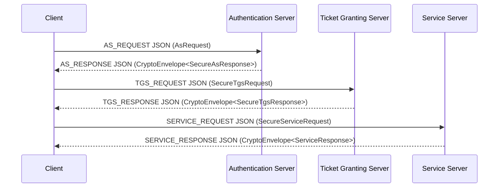

# Kerberos-Inspired Modular Authentication Demo

Proyecto Java de portafolio que implementa desde cero un flujo de autenticacion
distribuida inspirado en Kerberos 4, centrado ahora en una arquitectura modular
propia.

Este repositorio no es MIT Kerberos oficial y no debe presentarse como un
sistema listo para produccion critica. Es una pieza de ingenieria aplicada para
mostrar arquitectura distribuida, diseno de protocolo, hardening incremental,
pruebas y ejecucion local reproducible.

## Estado Actual

Fase actual: **Fase 8.1: ruta modular como version principal y legacy fisico
retirado**.

| Area | Rol | Estado |
| --- | --- | --- |
| `auth-core/` | DTOs del protocolo, configuracion y replay cache | Activo |
| `auth-crypto/` | AES-GCM, `CryptoEnvelope`, derivacion y claves de sesion | Activo |
| `auth-transport/` | `ProtocolEnvelope`, JSON/TCP, DTOs seguros y adaptadores historicos aislados | Activo |
| `auth-as/` | Authentication Server modular | Ejecutable |
| `auth-tgs/` | Ticket Granting Server modular | Ejecutable |
| `auth-service/` | Servicio protegido modular | Ejecutable |
| `auth-client-sdk/` | Cliente modular, CLI y audit runner | Ejecutable |
| `docs/` | Documentacion tecnica y auditorias | Activa |

Las carpetas historicas `Kerberos/`, `Seguridad/`, `Chat/` y
`DistribucionClaves/` fueron retiradas del proyecto principal. Su existencia se
resume en [docs/legacy-summary.md](docs/legacy-summary.md), sin conservarlas
como ruta ejecutable actual.

## Arquitectura Modular

Vista simplificada:



La ruta principal usa DTOs tipados, JSON/TCP, AES-GCM con `CryptoEnvelope`,
replay cache, configuracion demo/strict y auditoria reproducible.

## Requisitos

Consulta tambien [requirements.txt](requirements.txt).

- Java 17 o superior.
- Maven 3.9+.
- Git.
- Windows, Linux o macOS con terminal.
- Docker no es requisito en esta fase.

## Compilar Y Probar

Desde esta carpeta:

```bash
mvn -q -DskipTests compile
mvn test
```

En la verificacion de Fase 8.1 ambos comandos pasaron usando Maven por ruta
absoluta del entorno local.

## Ejecutar Sin Docker

En Windows, abre tres terminales para servidores y una para cliente:

```cmd
scripts\run-as.bat
```

```cmd
scripts\run-tgs.bat
```

```cmd
scripts\run-service.bat
```

```cmd
scripts\run-client.bat
```

Los scripts compilan con Maven antes de ejecutar las clases modulares.

## Auditoria Modular

Con AS, TGS y Service levantados:

```cmd
scripts\run-audit.bat --iterations 5
```

El runner genera evidencia en:

- `docs/audits/latest-run.md`
- `docs/audits/latest-run.json`

La auditoria de independencia legacy esta en
[docs/audits/legacy-dependency-audit.md](docs/audits/legacy-dependency-audit.md).

## Configuracion

Variables comunes:

- `AUTH_MODE`: `demo`, `local` o `strict`.
- `AUTH_AS_PORT`
- `AUTH_TGS_PORT`
- `AUTH_SERVICE_PORT`
- `AUTH_DEMO_CLIENT_ID`
- `AUTH_DEMO_TGS_ID`
- `AUTH_DEMO_SERVICE_ID`
- `AUTH_TICKET_TTL_MINUTES`
- `AUTH_ALLOWED_SKEW_SECONDS`
- `AUTH_REPLAY_WINDOW_SECONDS`
- `AUTH_LEGACY_CLIENT_SECRET`
- `AUTH_LEGACY_CLIENT_TGS_KEY`
- `AUTH_LEGACY_TGS_SECRET`
- `AUTH_LEGACY_CLIENT_SERVICE_KEY`
- `AUTH_LEGACY_SERVICE_SECRET`
- `AUTH_LEGACY_PBKDF2_SALT`

Los nombres `AUTH_LEGACY_*` permanecen por compatibilidad de configuracion y
deben renombrarse en una fase posterior.

## CI

GitHub Actions vive en la raiz Git:

- `../.github/workflows/maven.yml`

El workflow usa `working-directory: PruebaKeberos` y ejecuta:

- `mvn -q -DskipTests compile`
- `mvn test`

## Limitaciones Actuales

- No es production-ready.
- No hay Docker, frontend ni WebSockets.
- El replay cache es local por proceso.
- No hay TLS ni autenticacion mutua de transporte.
- El codec JSON es propio y acotado a los DTOs del proyecto.
- Persisten adaptadores historicos dentro de `auth-transport` para pruebas y
  compatibilidad documental, pero no son la ruta principal.

## Roadmap

1. Retirar o renombrar adaptadores historicos internos de `auth-transport` si
   ya no aportan valor.
2. Renombrar variables `AUTH_LEGACY_*` a nombres modulares.
3. Evaluar un parser JSON mantenido si se autoriza una dependencia.
4. Agregar TLS o una capa de transporte autenticada.
5. Introducir Docker y Docker Compose solo en una fase futura de despliegue.
6. Evaluar WebSockets y frontend solo cuando exista una fase especifica.

Mas detalle:

- [docs/execution-guide.md](docs/execution-guide.md)
- [docs/architecture.md](docs/architecture.md)
- [docs/protocol-flow.md](docs/protocol-flow.md)
- [docs/security-hardening-roadmap.md](docs/security-hardening-roadmap.md)
