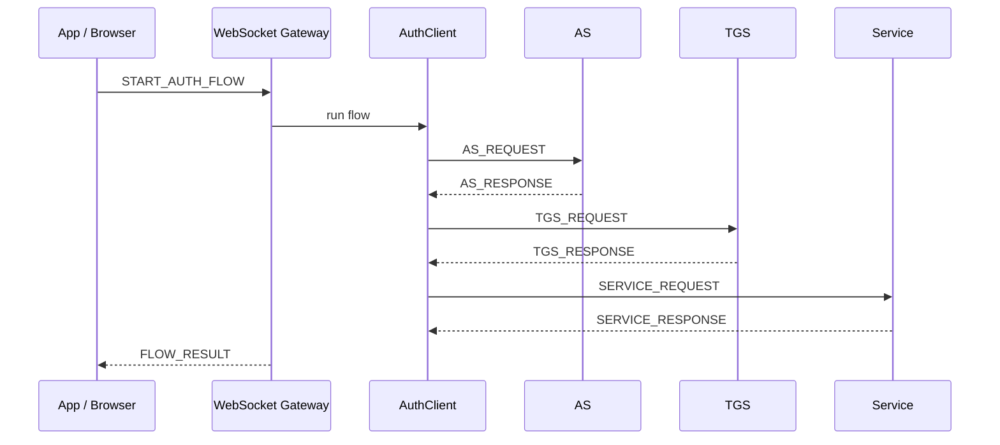

# Kerberos-Inspired Modular Authentication Demo

Proyecto Java de portafolio que implementa un flujo de autenticacion distribuida
inspirado en Kerberos 4, con una arquitectura modular propia bajo `auth-*`.

Este repositorio no es MIT Kerberos oficial y no debe presentarse como un
sistema listo para produccion critica. Es una base local para estudiar
protocolos, integracion, persistencia SQLite, Gateway WebSocket y demos
reproducibles con o sin Docker.

Fase actual: **Fase 16 + Fase 17: seguridad operativa, API integrable y
despliegue local reproducible con Docker**.

## Que Problema Resuelve

El proyecto muestra como una aplicacion puede delegar una decision de acceso a
un flujo distribuido AS -> TGS -> Service, y luego abrir una zona protegida solo
cuando el servicio devuelve `FLOW_RESULT success=true`.

No implementa login tradicional con password de usuario final. La demo usa
`clientId` y `serviceId` para demostrar autenticacion distribuida local.

## Modulos

| Modulo | Responsabilidad |
| --- | --- |
| `auth-core/` | DTOs, configuracion, replay cache y contratos de repositorio/auditoria |
| `auth-crypto/` | AES-GCM, `CryptoEnvelope`, derivacion y claves de sesion |
| `auth-transport/` | `ProtocolEnvelope`, JSON/TCP y DTOs seguros |
| `auth-storage-sqlite/` | Repositorios SQLite, migraciones, auditoria y CLI local |
| `auth-as/` | Authentication Server modular |
| `auth-tgs/` | Ticket Granting Server modular |
| `auth-service/` | Servicio protegido y `ProtectedResource` |
| `auth-client-sdk/` | Cliente modular, CLI y runners de auditoria |
| `auth-websocket-gateway/` | Gateway WebSocket separado para apps web/locales |
| `auth-web-demo/` | Demo tecnica del flujo AS -> TGS -> Service |
| `sample-login-app/` | Mini app tipo login para integradores |

## Flujo


```mermaid
sequenceDiagram
    participant App as App / Browser
    participant GW as WebSocket Gateway
    participant C as AuthClient
    participant AS as AS
    participant TGS as TGS
    participant S as Service

    App->>GW: START_AUTH_FLOW
    GW->>C: run flow
    C->>AS: AS_REQUEST
    AS-->>C: AS_RESPONSE
    C->>TGS: TGS_REQUEST
    TGS-->>C: TGS_RESPONSE
    C->>S: SERVICE_REQUEST
    S-->>C: SERVICE_RESPONSE
    GW-->>App: FLOW_RESULT
```

## Compilar Y Probar

```bash
mvn -q -DskipTests compile
mvn test
mvn -pl auth-storage-sqlite -am test
mvn -pl auth-websocket-gateway -am test
```

## Ejecutar Demo Tecnica

Windows:

```cmd
scripts\run-as.bat
scripts\run-tgs.bat
scripts\run-service.bat
scripts\run-websocket-gateway.bat
scripts\run-web-demo.bat
```

Abrir:

```text
http://127.0.0.1:5173
```

Linux/macOS:

```bash
scripts/run-as.sh
scripts/run-tgs.sh
scripts/run-service.sh
scripts/run-websocket-gateway.sh
scripts/run-web-demo.sh
```

## Ejecutar Mini App De Login

Con AS, TGS, Service y Gateway levantados:

```cmd
scripts\run-sample-login-app.bat
```

Linux/macOS:

```bash
scripts/run-sample-login-app.sh
```

Abrir:

```text
http://127.0.0.1:5174
```

Usar `clientId=1`, `serviceId=1` para un flujo exitoso. Usar un `serviceId`
invalido para verificar acceso denegado.

## Ejecutar Con Docker Compose

Docker es opcional para levantar la demo local completa sin abrir cinco
terminales. Requiere Docker Desktop:

```cmd
copy .env.example .env
scripts\docker-up.bat
```

Linux/macOS:

```bash
cp .env.example .env
scripts/docker-up.sh
```

Abrir:

```text
http://localhost:5173
http://localhost:5174
ws://localhost:2800
```

AS, TGS y Service quedan en una red interna de Docker; solo se publican Gateway,
web demo y sample-login-app. Ver [docs/docker-deployment.md](docs/docker-deployment.md).

## SQLite Local

Modo demo por defecto:

```text
AUTH_STORAGE_MODE=memory
```

Inicializar SQLite con migraciones:

```cmd
scripts\init-sqlite-demo.bat --db data\auth-demo.sqlite
```

Linux/macOS:

```bash
scripts/init-sqlite-demo.sh --db data/auth-demo.sqlite
```

Ejecutar servidores con SQLite:

```cmd
set AUTH_STORAGE_MODE=sqlite
set AUTH_SQLITE_PATH=data\auth-demo.sqlite
scripts\run-as.bat
scripts\run-tgs.bat
scripts\run-service.bat
scripts\run-websocket-gateway.bat
```

Las migraciones viven en `scripts/sqlite/migrations/` y registran versiones en
`schema_version`.

## Administracion Local

Registrar cliente:

```cmd
scripts\sqlite-admin.bat --db data\auth-demo.sqlite clients add --id app-client --display-name "App Client" --secret "<secret>"
```

Registrar servicio:

```cmd
scripts\sqlite-admin.bat --db data\auth-demo.sqlite services add --id melodyfinder --display-name "MelodyFinder" --secret "<secret>" --endpoint local://melodyfinder
```

Listar y activar/desactivar:

```cmd
scripts\sqlite-admin.bat --db data\auth-demo.sqlite clients list
scripts\sqlite-admin.bat --db data\auth-demo.sqlite services list
scripts\sqlite-admin.bat --db data\auth-demo.sqlite clients disable --id app-client
scripts\sqlite-admin.bat --db data\auth-demo.sqlite services enable --id melodyfinder
```

Consultar auditoria:

```cmd
scripts\sqlite-admin.bat --db data\auth-demo.sqlite audit list --limit 20
scripts\sqlite-admin.bat --db data\auth-demo.sqlite audit by-request --request-id sample-login-1
scripts\sqlite-admin.bat --db data\auth-demo.sqlite audit by-client --client-id 1
scripts\sqlite-admin.bat --db data\auth-demo.sqlite audit by-service --service-id 1
```

La salida no imprime secretos, tickets, claves ni ciphertexts.

## Using This Project To Secure Your Own App

1. Registrar un cliente en SQLite con `scripts\sqlite-admin.bat ... clients add`.
2. Registrar un servicio con `scripts\sqlite-admin.bat ... services add`.
3. Inicializar o migrar la base con `scripts\init-sqlite-demo.bat`.
4. Levantar AS, TGS y Service con `AUTH_STORAGE_MODE=sqlite`.
5. Levantar `auth-websocket-gateway`.
6. Desde la app, abrir `ws://127.0.0.1:2800`.
7. Enviar `START_AUTH_FLOW` con `requestId`, `clientId` y `serviceId`.
8. Validar `FLOW_RESULT`: solo conceder acceso si `success=true`.
9. Mostrar datos de alto nivel como `requestId` y mensaje del servicio.
10. Consultar auditoria con `sqlite-admin ... audit list`, `by-request`,
    `by-client` o `by-service`.

La app conserva responsabilidad sobre UI, sesiones propias, autorizacion de
negocio, expiracion de sesion web, TLS y almacenamiento de usuario. Este sistema
asume la validacion modular AS -> TGS -> Service y la auditoria local SQLite del
flujo cuando el Gateway corre en modo SQLite. SQLite pertenece al sistema de
autenticacion; la app externa no debe conectarse directamente a esa base.

## API De Integracion

Para integrar un servicio real, implementar `ProtectedResource`:

```java
String getServiceId();
ProtectedServiceResponse execute(ProtectedServiceRequest request);
```

`DemoProtectedResource` es el ejemplo local. `HttpProtectedResource` muestra como
reenviar una llamada a un servidor HTTP local simple en pruebas, sin consumir
APIs externas reales.

## Limitaciones

- No es MIT Kerberos oficial.
- No esta listo para produccion critica.
- Docker local es opcional; no hay Spring Boot, PostgreSQL, ORM pesado, React ni Next.js.
- SQLite es persistencia local verificable, no una base productiva.
- No hay TLS ni autenticacion mutua en TCP/WebSocket.
- Los secretos demo no deben usarse fuera de ejecucion local.
- El replay cache sigue siendo local por proceso.

## Roadmap

1. Endurecer transporte con TLS/autenticacion mutua.
2. Separar secretos demo de secretos operativos con vault o mecanismo externo.
3. Agregar politicas de autorizacion por recurso.
4. Evaluar parser JSON mantenido si el codec propio crece.
5. Agregar TLS/mTLS y gestion operativa de secretos.

## Mas Documentacion

- [docs/execution-guide.md](docs/execution-guide.md)
- [docs/architecture.md](docs/architecture.md)
- [docs/sqlite-integration.md](docs/sqlite-integration.md)
- [docs/integration-api.md](docs/integration-api.md)
- [docs/using-auth-api.md](docs/using-auth-api.md)
- [docs/sample-login-app.md](docs/sample-login-app.md)
- [docs/docker-deployment.md](docs/docker-deployment.md)
- [docs/websocket-gateway.md](docs/websocket-gateway.md)
- [docs/frontend-demo.md](docs/frontend-demo.md)
- [docs/concurrency.md](docs/concurrency.md)
- [docs/security-hardening-roadmap.md](docs/security-hardening-roadmap.md)
- [docs/audits/maven-dependency-audit.md](docs/audits/maven-dependency-audit.md)
