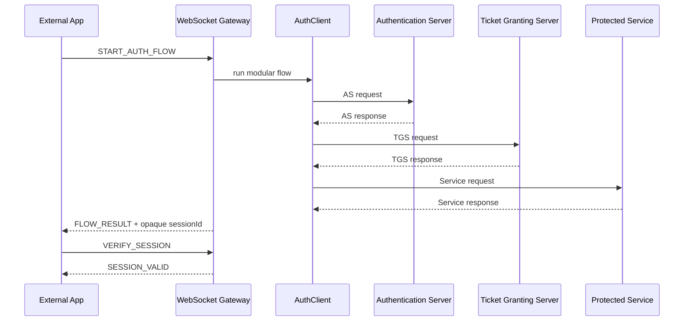

# Kerberos-Inspired Modular Authentication Portfolio

Modular Java portfolio project that demonstrates distributed authentication
inspired by Kerberos. It is not official MIT Kerberos and must not be presented
as ready for critical production use. The goal is educational, technical, and
demonstrable: to show how an external app can delegate an access decision to an
AS -> TGS -> Service flow and accept access only after verifying an opaque
session issued by the Gateway.

Closing status: **Phase 23A: professional documentation, advanced protocol
visualization, final portfolio interface, and technical evidence**.

## Problem It Solves

An external app should not decide access only because it received a local
boolean. This project shows a safer path: the app requests authentication from
`auth-websocket-gateway`, the Gateway runs the modular flow, issues an opaque
session if the service granted access, and the app grants its own access only
when `VERIFY_SESSION` returns `SESSION_VALID`.

The external app does not connect to PostgreSQL, AS, TGS, or Service. It only
talks to the Gateway through WebSocket.

## Core Concepts

| Concept | Short explanation |
| --- | --- |
| Kerberos | Distributed authentication protocol based on tickets. This project is only inspired by that model. |
| Distributed model | Splits responsibilities between client, AS, TGS, and protected service. |
| Client | Identity requesting access to a service. Demos use `clientId`. |
| Authentication Server (AS) | Validates the client and prepares access toward TGS. |
| Ticket Granting Server (TGS) | Issues conceptual access to the requested service if it is registered. |
| Service Server | Protected service that decides whether to answer the authenticated client. |
| Ticket | Temporary proof for a specific server. The UI only shows the concept, never the real content. |
| Session | Temporary access state. |
| Opaque session | Random identifier stored server-side; the browser cannot self-validate it. |
| `success=true` | Flow result, not final authorization for external apps. |
| `SESSION_VALID` | Gateway confirmation required before granting access. |
| Timestamp | Time mark used to control validity and replay attacks. |
| Replay attack | Reuse of an earlier request or authenticator. |
| Replay cache | Temporary registry that rejects reuse before entries expire. |
| AES | Symmetric encryption algorithm. |
| Symmetric encryption | The same family of secret is used for encryption and decryption. |
| AES-GCM | Authenticated AES mode that protects confidentiality and integrity. |
| Docker | Packages services for reproducible local execution. |
| Docker Compose | Starts multiple containers as a local stack. |
| PostgreSQL | Relational database used for cloud/RDS preparation and shared sessions. |
| SQLite | Lightweight local database for demo and verifiable local integration. |
| Terraform | Defines infrastructure as code. In this repo only plan was validated, without apply. |
| AWS | Cloud-ready blueprint with ECS/Fargate, ALB, ACM, RDS, Secrets Manager, and CloudWatch. |
| ECS/Fargate | Runs containers without managing servers. |
| ECR | Docker image registry on AWS. |
| ALB | Load balancer that would publish Gateway/web demos. |
| ACM | TLS certificates for HTTPS/WSS. |
| WSS | Secure WebSocket over TLS. |
| RDS PostgreSQL | Managed PostgreSQL for shared sessions and audit. |
| Secrets Manager | Recommended service for cloud secrets. |
| CloudWatch | Logs and metrics on AWS. |
| Service Discovery | Internal resolution between ECS services. |
| Public subnet | Network that can expose the ALB. |
| Private subnet | Network for AS/TGS/Service/RDS without direct public access. |

AS, TGS, and Service must not be public. The Gateway can be published through
ALB/WSS because it is the controlled integration layer.

## Modules

| Module | Responsibility |
| --- | --- |
| `auth-core/` | DTOs, configuration, contracts, replay cache, sessions, health, logs, and metrics. |
| `auth-crypto/` | AES-GCM, `CryptoEnvelope`, derivation, and session keys. |
| `auth-transport/` | Modular JSON/TCP and secure messages. |
| `auth-as/` | Modular Authentication Server. |
| `auth-tgs/` | Modular Ticket Granting Server. |
| `auth-service/` | Protected service and resource adapters. |
| `auth-client-sdk/` | Modular client, CLI, and audit runners. |
| `auth-storage-sqlite/` | SQLite repositories, migrations, audit, and local sessions. |
| `auth-storage-postgres/` | PostgreSQL/RDS-ready repositories. |
| `auth-websocket-gateway/` | Separate WebSocket API for external apps. |
| `auth-web-demo/` | Vanilla protocol visualization dashboard. |
| `sample-login-app/` | MelodyFinder vanilla mini app for integrators. |

## Main Flow



The browser never receives raw tickets, keys, ciphertexts, or sensitive
cryptographic material. The UI masks `sessionId`.

## Local Ports

| Component | Port |
| --- | --- |
| WebSocket Gateway | `2800` |
| Gateway health | `2801` |
| auth-web-demo | `5173` |
| sample-login-app | `5174` |

## Local Execution Without Docker

Windows:

```powershell
mvn validate
mvn test
scripts\run-as.bat
scripts\run-tgs.bat
scripts\run-service.bat
scripts\run-websocket-gateway.bat
scripts\run-web-demo.bat
scripts\run-sample-login-app.bat
```

Linux/macOS:

```bash
mvn validate
mvn test
scripts/run-as.sh
scripts/run-tgs.sh
scripts/run-service.sh
scripts/run-websocket-gateway.sh
scripts/run-web-demo.sh
scripts/run-sample-login-app.sh
```

Open:

```text
http://localhost:5173
http://localhost:5174
```

## Local Docker

Local SQLite:

```bash
docker compose build
docker compose up -d
curl http://localhost:2801/health
```

Local PostgreSQL:

```bash
docker compose --env-file .env.postgres --profile postgres-local build
docker compose --env-file .env.postgres --profile postgres-local up -d
docker compose --env-file .env.postgres --profile postgres-local ps
curl http://localhost:2801/health
```

Stop:

```bash
docker compose --env-file .env.postgres --profile postgres-local down
```

## API For Your Own Apps

Local endpoint:

```text
ws://localhost:2800
```

Future cloud endpoint:

```text
wss://auth.example.com
```

Main messages:

```json
{"type":"START_AUTH_FLOW","requestId":"app-1","clientId":"1","serviceId":"1"}
```

```json
{"type":"VERIFY_SESSION","requestId":"app-1-verify","sessionId":"opaque-session-id","clientId":"1","serviceId":"1"}
```

```json
{"type":"LOGOUT_SESSION","requestId":"app-1-logout","sessionId":"opaque-session-id"}
```

The integration rule is strict: grant access only with `SESSION_VALID`; deny it
with `SESSION_INVALID`, `ERROR`, or `FLOW_RESULT.success=false`.

See [docs/api-integration-guide.md](docs/api-integration-guide.md).

## AWS Deployment Blueprint

`infra/aws/terraform/` prepares a cloud-ready blueprint with VPC,
public/private subnets, ALB, ECS/Fargate, CloudWatch, ECR, Service Discovery,
Secrets Manager, and prepared RDS PostgreSQL. `terraform init`,
`terraform validate`, and `terraform plan` were validated for temporary HTTP and
WSS/HTTPS with an ACM placeholder.

## Documented Validations

| Validation | Documented status |
| --- | --- |
| Maven validate | PASS |
| Maven test | PASS |
| Gateway tests | PASS |
| SQLite tests | PASS |
| PostgreSQL tests | PASS |
| Docker Compose SQLite | PASS |
| Docker Compose PostgreSQL local | PASS |
| Gateway `/health` | PASS |
| Web demo | PASS |
| Sample login app | PASS |
| Terraform init/validate/plan | PASS |

See [docs/project-validation-results.md](docs/project-validation-results.md).

## Main Documentation

- [docs/non-technical-explanation.md](docs/non-technical-explanation.md)
- [docs/glossary.md](docs/glossary.md)
- [docs/architecture.md](docs/architecture.md)
- [docs/protocol-flow.md](docs/protocol-flow.md)
- [docs/technical-deep-dive.md](docs/technical-deep-dive.md)
- [docs/frontend-visualization-guide.md](docs/frontend-visualization-guide.md)
- [docs/security-validation-lab.md](docs/security-validation-lab.md)
- [docs/docker-local-runbook.md](docs/docker-local-runbook.md)
- [docs/install-linux.md](docs/install-linux.md)
- [docs/install-macos.md](docs/install-macos.md)
- [docs/install-windows.md](docs/install-windows.md)
- [docs/aws-terraform-readiness.md](docs/aws-terraform-readiness.md)

## Limits

- It is not official MIT Kerberos.
- It is not a critical production readiness declaration.
- `terraform apply` was not executed.
- Real secrets are not versioned.
- SQLite is demo/local; PostgreSQL is the prepared cloud/RDS path.
- Visual demos do not replace automated tests.
