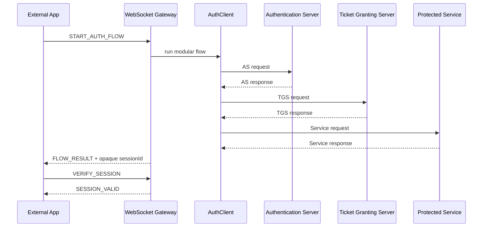

# Kerberos-Inspired Modular Authentication Portfolio

Proyecto Java modular de portafolio que demuestra autenticacion distribuida
inspirada en Kerberos. No es MIT Kerberos oficial y no debe presentarse como
listo para produccion critica. El objetivo es educativo, tecnico y demostrable:
mostrar como una app externa puede delegar una decision de acceso a un flujo
AS -> TGS -> Service y aceptar acceso solo despues de verificar una sesion
opaca emitida por el Gateway.

Estado de cierre: **Fase 23A: documentacion profesional, visualizacion avanzada
del protocolo, interfaz final de portafolio y evidencia tecnica**.

## Que Problema Resuelve

Una app externa no deberia decidir acceso solo porque recibio un boolean local.
Este proyecto muestra una ruta mas segura: la app pide autenticacion al
`auth-websocket-gateway`, el Gateway ejecuta el flujo modular, emite una sesion
opaca si el servicio concedio acceso, y la app concede acceso propio solo cuando
`VERIFY_SESSION` devuelve `SESSION_VALID`.

La app externa no se conecta a PostgreSQL, AS, TGS ni Service. Solo habla con el
Gateway por WebSocket.

## Conceptos Principales

| Concepto | Explicacion breve |
| --- | --- |
| Kerberos | Protocolo de autenticacion distribuida basado en tickets. Este proyecto solo esta inspirado en ese modelo. |
| Modelo distribuido | Divide responsabilidades entre cliente, AS, TGS y servicio protegido. |
| Cliente | Identidad que solicita acceso a un servicio. En demos se usa `clientId`. |
| Authentication Server (AS) | Valida al cliente y prepara acceso hacia TGS. |
| Ticket Granting Server (TGS) | Emite acceso conceptual al servicio solicitado si esta registrado. |
| Service Server | Servicio protegido que decide si responde al cliente autenticado. |
| Ticket | Prueba temporal para un servidor especifico. La UI solo muestra el concepto, nunca el contenido real. |
| Sesion | Estado temporal de acceso. |
| Sesion opaca | Identificador aleatorio guardado server-side; el browser no puede auto-validarlo. |
| `success=true` | Resultado de flujo, no autorizacion final para apps externas. |
| `SESSION_VALID` | Confirmacion del Gateway requerida antes de conceder acceso. |
| Timestamp | Marca temporal usada para controlar vigencia y ataques de repeticion. |
| Replay attack | Reuso de una solicitud o autenticador anterior. |
| Replay cache | Registro temporal que rechaza reusos antes de que expiren. |
| AES | Algoritmo de cifrado simetrico. |
| Cifrado simetrico | La misma familia de secreto sirve para cifrar y descifrar. |
| AES-GCM | Modo autenticado de AES que protege confidencialidad e integridad. |
| Docker | Empaqueta servicios para ejecucion local reproducible. |
| Docker Compose | Levanta varios contenedores como un stack local. |
| PostgreSQL | Base relacional usada como preparacion cloud/RDS y sesiones compartidas. |
| SQLite | Base local ligera para demo e integracion local verificable. |
| Terraform | Define infraestructura como codigo. En este repo solo se valido plan, sin apply. |
| AWS | Blueprint cloud-ready con ECS/Fargate, ALB, ACM, RDS, Secrets Manager y CloudWatch. |
| ECS/Fargate | Ejecuta contenedores sin administrar servidores. |
| ECR | Registry para imagenes Docker en AWS. |
| ALB | Balanceador que publicaria Gateway/web demos. |
| ACM | Certificados TLS para HTTPS/WSS. |
| WSS | WebSocket seguro sobre TLS. |
| RDS PostgreSQL | PostgreSQL administrado para sesiones y auditoria compartidas. |
| Secrets Manager | Servicio recomendado para secretos cloud. |
| CloudWatch | Logs y metricas en AWS. |
| Service Discovery | Resolucion interna entre servicios ECS. |
| Subnet publica | Red que puede exponer ALB. |
| Subnet privada | Red para AS/TGS/Service/RDS sin acceso publico directo. |

AS, TGS y Service no deben ser publicos. El Gateway puede publicarse mediante
ALB/WSS porque es la capa de integracion controlada.

## Modulos

| Modulo | Responsabilidad |
| --- | --- |
| `auth-core/` | DTOs, configuracion, contratos, replay cache, sesiones, health, logs y metricas. |
| `auth-crypto/` | AES-GCM, `CryptoEnvelope`, derivacion y claves de sesion. |
| `auth-transport/` | JSON/TCP modular y mensajes seguros. |
| `auth-as/` | Authentication Server modular. |
| `auth-tgs/` | Ticket Granting Server modular. |
| `auth-service/` | Servicio protegido y adaptadores de recurso. |
| `auth-client-sdk/` | Cliente modular, CLI y runners de auditoria. |
| `auth-storage-sqlite/` | Repositorios SQLite, migraciones, auditoria y sesiones locales. |
| `auth-storage-postgres/` | Repositorios PostgreSQL/RDS-ready. |
| `auth-websocket-gateway/` | API WebSocket separada para apps externas. |
| `auth-web-demo/` | Dashboard vanilla de visualizacion del protocolo. |
| `sample-login-app/` | Mini app vanilla MelodyFinder para integradores. |

## Flujo Principal



El navegador nunca recibe tickets crudos, claves, ciphertexts ni material
criptografico sensible. La UI enmascara `sessionId`.

## Puertos Locales

| Componente | Puerto |
| --- | --- |
| WebSocket Gateway | `2800` |
| Gateway health | `2801` |
| auth-web-demo | `5173` |
| sample-login-app | `5174` |

## Ejecucion Local Sin Docker

Windows:

```powershell
mvn validate
mvn test
scripts\run-as.bat
scripts\run-tgs.bat
scripts\run-service.bat
scripts\run-websocket-gateway.bat
scripts\run-web-demo.bat
scripts\run-sample-login-app.bat
```

Linux/macOS:

```bash
mvn validate
mvn test
scripts/run-as.sh
scripts/run-tgs.sh
scripts/run-service.sh
scripts/run-websocket-gateway.sh
scripts/run-web-demo.sh
scripts/run-sample-login-app.sh
```

Abrir:

```text
http://localhost:5173
http://localhost:5174
```

## Docker Local

SQLite local:

```bash
docker compose build
docker compose up -d
curl http://localhost:2801/health
```

PostgreSQL local:

```bash
docker compose --env-file .env.postgres --profile postgres-local build
docker compose --env-file .env.postgres --profile postgres-local up -d
docker compose --env-file .env.postgres --profile postgres-local ps
curl http://localhost:2801/health
```

Apagar:

```bash
docker compose --env-file .env.postgres --profile postgres-local down
```

## API Para Apps Propias

Endpoint local:

```text
ws://localhost:2800
```

Endpoint cloud futuro:

```text
wss://auth.dominio.com
```

Mensajes principales:

```json
{"type":"START_AUTH_FLOW","requestId":"app-1","clientId":"1","serviceId":"1"}
```

```json
{"type":"VERIFY_SESSION","requestId":"app-1-verify","sessionId":"opaque-session-id","clientId":"1","serviceId":"1"}
```

```json
{"type":"LOGOUT_SESSION","requestId":"app-1-logout","sessionId":"opaque-session-id"}
```

La regla de integracion es estricta: conceder acceso solo con `SESSION_VALID`;
negarlo con `SESSION_INVALID`, `ERROR` o `FLOW_RESULT.success=false`.

Ver [docs/api-integration-guide.md](docs/api-integration-guide.md).

## AWS Deployment Blueprint

`infra/aws/terraform/` prepara un blueprint cloud-ready con VPC, subnets
publicas/privadas, ALB, ECS/Fargate, CloudWatch, ECR, Service Discovery,
Secrets Manager y RDS PostgreSQL preparado. Se valido `terraform init`,
`terraform validate` y `terraform plan` para HTTP temporal y WSS/HTTPS con ACM
placeholder.


## Validaciones Documentadas

| Validacion | Estado documentado |
| --- | --- |
| Maven validate | PASS |
| Maven test | PASS |
| Gateway tests | PASS |
| SQLite tests | PASS |
| PostgreSQL tests | PASS |
| Docker Compose SQLite | PASS |
| Docker Compose PostgreSQL local | PASS |
| Gateway `/health` | PASS |
| Web demo | PASS |
| Sample login app | PASS |
| Terraform init/validate/plan | PASS |

Ver [docs/project-validation-results.md](docs/project-validation-results.md).

## Documentacion Principal

- [docs/non-technical-explanation.md](docs/non-technical-explanation.md)
- [docs/glossary.md](docs/glossary.md)
- [docs/architecture.md](docs/architecture.md)
- [docs/protocol-flow.md](docs/protocol-flow.md)
- [docs/technical-deep-dive.md](docs/technical-deep-dive.md)
- [docs/frontend-visualization-guide.md](docs/frontend-visualization-guide.md)
- [docs/security-validation-lab.md](docs/security-validation-lab.md)
- [docs/docker-local-runbook.md](docs/docker-local-runbook.md)
- [docs/install-linux.md](docs/install-linux.md)
- [docs/install-macos.md](docs/install-macos.md)
- [docs/install-windows.md](docs/install-windows.md)
- [docs/aws-terraform-readiness.md](docs/aws-terraform-readiness.md)

## Limites 

- No es MIT Kerberos oficial.
- No es una declaracion de produccion critica.
- No se ejecuto `terraform apply`.
- No se versionan secretos reales.
- SQLite es demo/local; PostgreSQL es la ruta preparada para cloud/RDS.
- Las demos visuales no sustituyen pruebas automatizadas.
