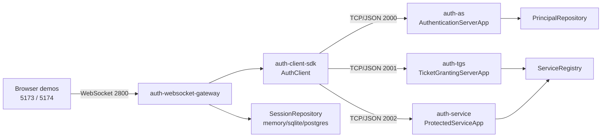
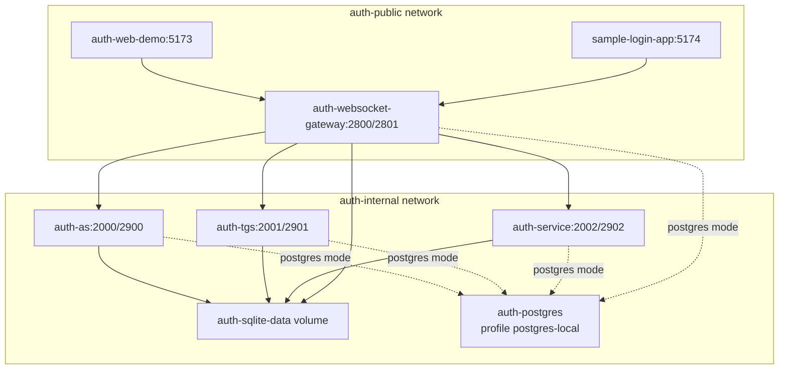
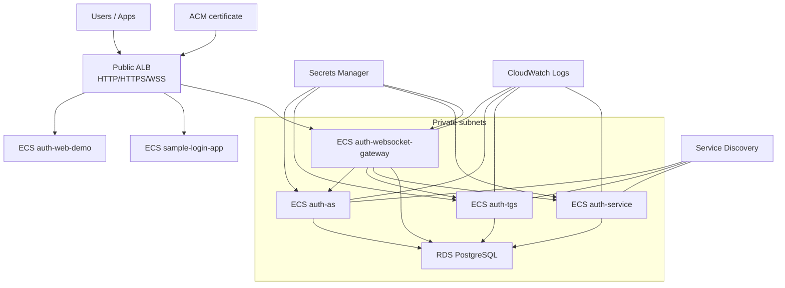
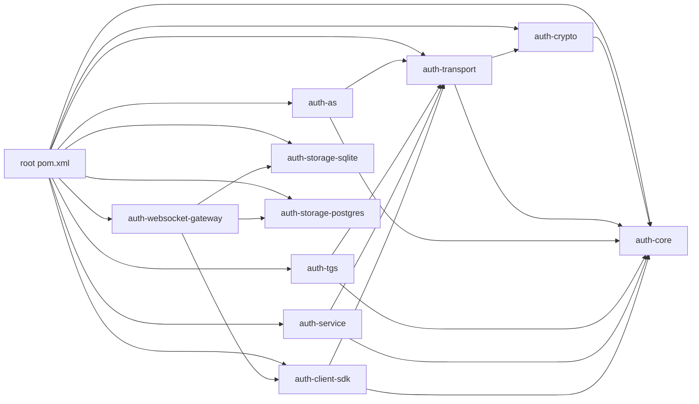
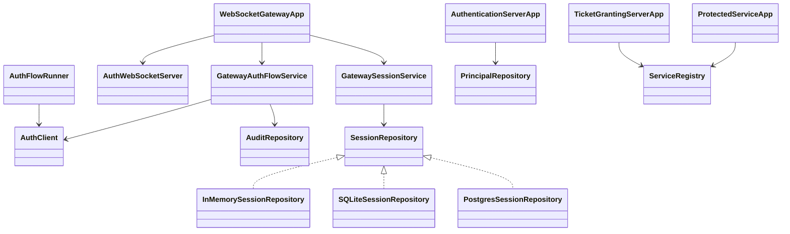

# Architecture

The main path is modular and lives in `auth-*`. It is not official MIT Kerberos
and must not be presented as ready for critical production use.

## Local Architecture

## Docker Deployment

## AWS Blueprint

AS/TGS/Service must not be public. The Gateway can be published through ALB/WSS
as the integration boundary.

## Maven Modules

## Main Class Diagram

## Storage Modes

| Mode | Use |
| --- | --- |
| `AUTH_STORAGE_MODE=memory` | default demo mode without persistence. |
| `AUTH_STORAGE_MODE=sqlite` | verifiable local integration. |
| `AUTH_STORAGE_MODE=postgres` | cloud/RDS-ready mode and multiple Gateway instances. |

`AUTH_SESSION_STORAGE_MODE` can follow the storage mode or be configured
explicitly as `memory`, `sqlite`, or `postgres`.
