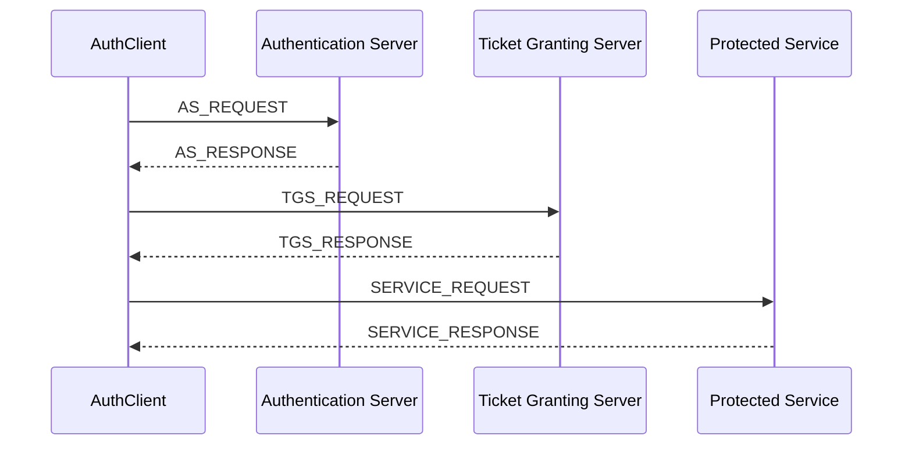
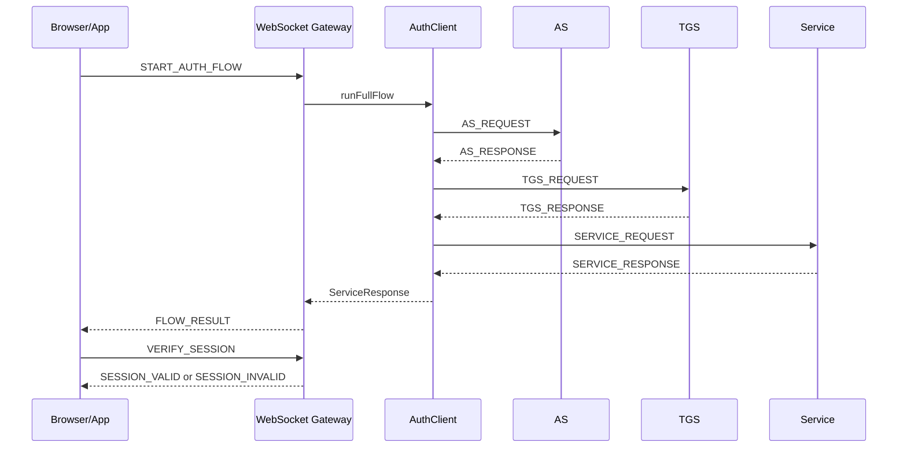
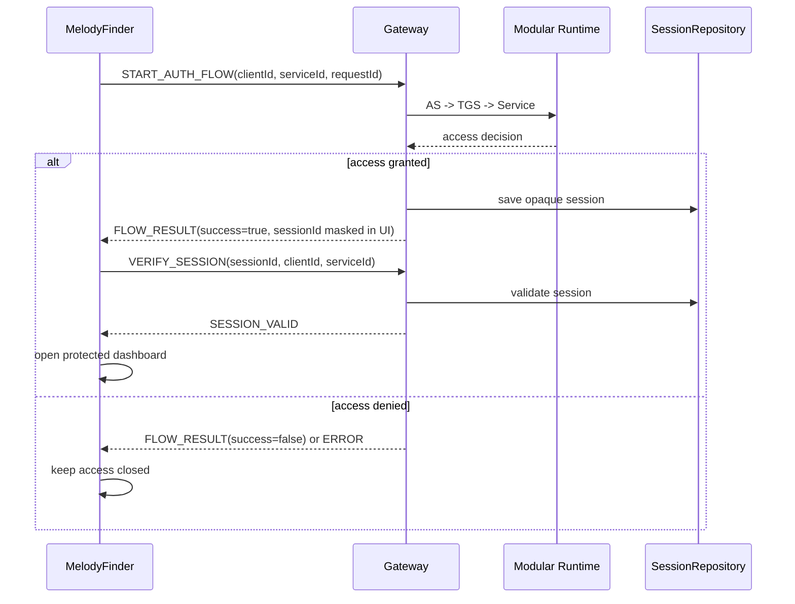
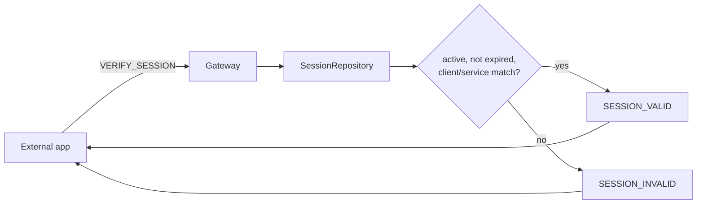
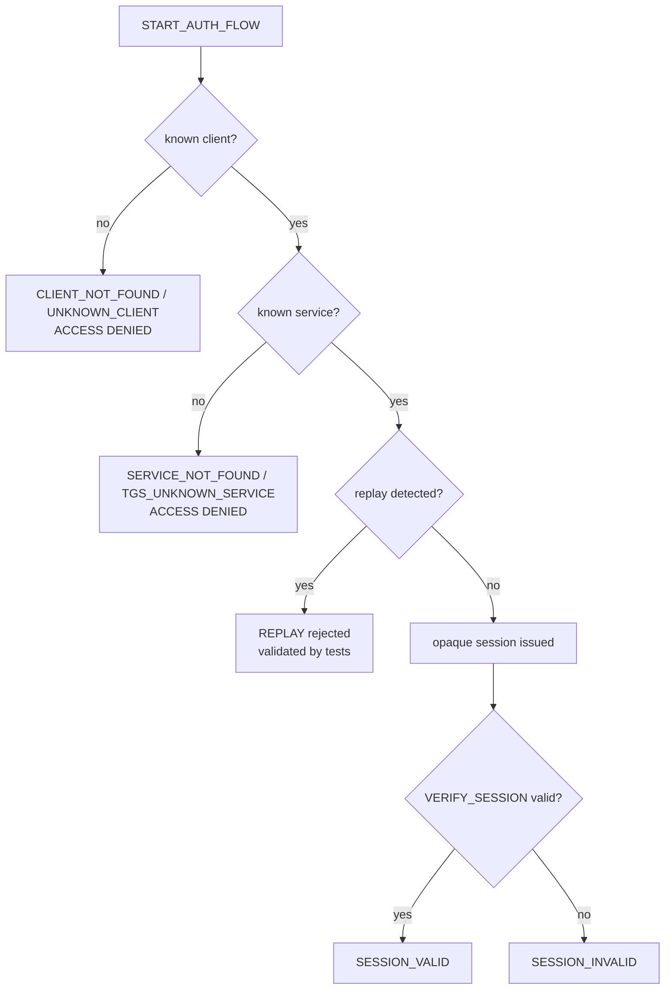

# Protocol Flow

El protocolo modular viaja por JSON/TCP entre AS, TGS y Service. El Gateway
WebSocket es una capa externa de integracion y no cambia el contrato interno.

## AS -> TGS -> Service

## Gateway -> AuthClient -> AS/TGS/Service

## Complete Login

## Opaque Session

## Conceptual Messages

```mermaid
flowchart LR
    M1["Client request\nclientId, serviceId, requestId"] --> M2["AS request\nclient identity, TGS, timestamp"]
    M2 --> M3["AS response\nclient-TGS material, TGS ticket, lifetime\nsensitive data omitted"]
    M3 --> M4["TGS request\nTGS ticket, authenticator, serviceId, timestamp"]
    M4 --> M5["TGS response\nservice ticket, client-service material, lifetime\nsensitive data omitted"]
    M5 --> M6["Service request\nservice ticket, authenticator, timestamp"]
    M6 --> M7["Service response\naccess decision, protected output"]
    M7 --> M8["FLOW_RESULT\nsuccess/failure, opaque session, latency"]
    M8 --> M9["VERIFY_SESSION\nopaque sessionId, clientId, serviceId"]
```

## Negative Scenarios

## WebSocket Contract

Entrada:

- `START_AUTH_FLOW`
- `VERIFY_SESSION`
- `LOGOUT_SESSION`
- `PING`

Salida:

- `FLOW_EVENT`
- `FLOW_RESULT`
- `SESSION_VALID`
- `SESSION_INVALID`
- `SESSION_LOGGED_OUT`
- `ERROR`
- `PONG`

`FLOW_RESULT.success=true` no es autorizacion final. La app debe esperar
`SESSION_VALID`.

## Security Notes

- No mostrar tickets crudos.
- No mostrar claves.
- No mostrar ciphertexts.
- No mostrar payloads sensibles.
- Enmascarar `sessionId`.
- Usar `wss://` para cloud.
